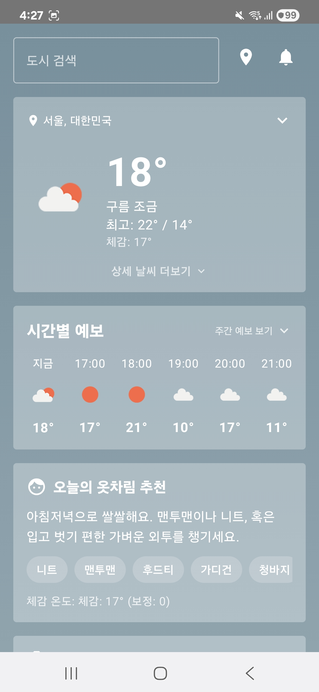
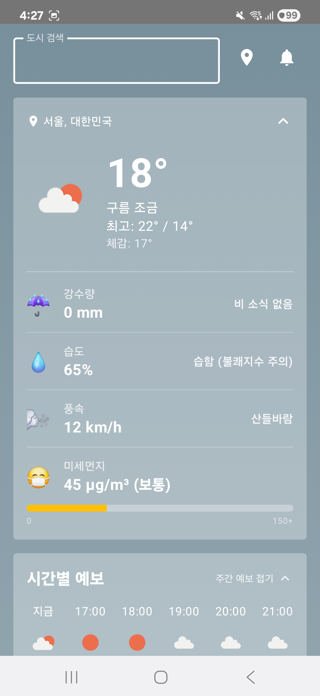
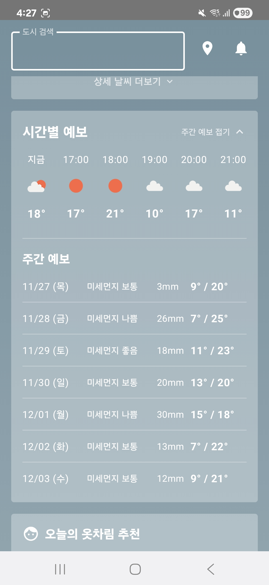

# weather-k3s

K3s 경량 쿠버네티스 환경에서 운영되는 날씨 및 CCTV 정보 제공 플랫폼입니다. 

---

## 프로젝트 설명

**weather-k3s**는 마이크로서비스 아키텍처 기반의 실시간 날씨 및 교통 정보 제공 플랫폼입니다.

**주요 특징**:
- **실시간 날씨 데이터**: 기상청 공공 API를 통한 현재 날씨, 시간별/주간 예보
- **고속도로 CCTV**: GPS 좌표 기반 근처 CCTV 검색 및 스트림 제공
- **성능 최적화**: Redis 캐싱으로 API 응답 속도 극대화
- **자동 배포**: GitOps 기반 ArgoCD로 선언적 배포 관리
- **보안**: Sealed Secrets를 통한 민감정보 암호화 관리
 - **앱 프론트엔드**: Kotlin으로 개발된 모바일 앱 화면 제공

---

## API 설명

### 1. Weather API (`/api/weather`)
기상청 공공 API를 통한 날씨 정보 제공

| 엔드포인트 | 설명 |
|-----------|------|
| `GET /api/weather/current?nx=60&ny=127` | 현재 날씨 (기온, 습도, 강수, 풍속, 미세먼지) |
| `GET /api/weather/forecast?nx=60&ny=127` | 24시간 시간별 날씨 예보 |
| `GET /api/weather/week?nx=60&ny=127` | 3-10일 주간 날씨 예보 |

**기술**: FastAPI, httpx 비동기 클라이언트, Redis 캐싱

### 2. CCTV API (`/get_cctv`)
ITS 국가교통정보센터 API를 통한 고속도로 CCTV 정보 조회

| 엔드포인트 | 설명 |
|-----------|------|
| `GET /get_cctv?lat=37.5665&lng=126.9780` | GPS 좌표 기반 근처 CCTV 검색 (±0.5도 범위) |

**기술**: FastAPI, requests, NumPy (거리 계산 및 정렬)

### 3. Redis Cache
모든 API 응답을 캐싱하여 성능 최적화 및 API 호출 제한 회피

---

## 시스템 아키텍처

.png)

---

## 기술 스택

| 계층 | 기술 |
|------|------|
| **API Framework** |   |
| **언어** |  |
| **프론트엔드** |  |
| **캐싱** |  |
| **컨테이너** |  |
| **오케스트레이션** |  |
| **GitOps** |  |
| **IaC** |   |
| **보안** |  |
| **Ingress** |  |
| **모니터링** |   |

---

## 앱 화면

<div align="center">

| | | |
|---|---|---|
|  |  |  |

</div>

---

## 인프라 요소

### Kubernetes 리소스

**Deployments** (3개 서비스)
- `weatherapi` (8000 포트) - 기상청 API 호출 및 데이터 처리
- `cctvapi` (8100 포트) - ITS CCTV API 호출 및 거리 계산
- `redis` (6379 포트) - 캐시 저장소, Persistent Volume 연결

**Services** (내부 통신)
- weatherapi-service (80 → 8000)
- cctvapi-service (80 → 8100)
- redis-service (6379)

**Ingress** (외부 접근)
```
Host: www.weapi.shop
├── /api/weather → weatherapi-service
├── /get_cctv → cctvapi-service
```

**Storage**
- redis-pvc: Persistent Volume Claim (데이터 지속성)

### 보안 (Sealed Secrets)
- `api-secret` - KMA_SERVICE_KEY
- `cctv-secret` - ITS_CCTV_API_KEY
- `ghcr-secret` - GitHub Container Registry 인증
- `tunnel-secret` - Clouedflare Tunnel Token

### GitOps 배포 (ArgoCD)
```
Root Application (자동 동기화 & 자동 복구)
├── ArgoCD (Argo CD 2.8+ 설치)
├── Sealed Secrets (암호화된 시크릿 관리)
├── Monitoring (Prometheus + Grafana)
├── Networking (Traefik, Cloudflare Tunnel)
└── Services
    ├── Weather API
    ├── CCTV API
    └── Redis
```

---

## 프로젝트 구조

```
weather-k3s/
├── app/                         # 애플리케이션 코드
│   ├── weatherapi/              # Weather API 서비스
│   │   ├── main.py              # 엔트리포인트
│   │   ├── api.py               # 라우터
│   │   ├── service.py           # 비즈니스 로직
│   │   ├── parsers.py           # 데이터 파싱
│   │   ├── Dockerfile
│   │   └── requirements.txt
│   ├── cctvapi/                 # CCTV API 서비스
│   │   ├── server.py            # FastAPI 서버
│   │   ├── Dockerfile
│   │   └── requirements.txt
│   └── shared/                  # 공유 라이브러리
│       └── redis/
│           ├── client.py        # Redis 클라이언트
│           └── __init__.py
│
├── k3s/                         # Kubernetes 배포 설정
│   ├── base/                    # 기본 리소스 (Deployment, Service, Secrets)
│   ├── overlays/                # 환경별 설정 (dev, prod)
│   ├── infra/                   # Traefik Ingress, ArgoCD Route
│   ├── setup/                   # ArgoCD, Monitoring, Sealed Secrets
│   ├── Application/             # ArgoCD Application 정의
│   └── bootstrap/               # GitOps 부트스트랩
```

---
## API 응답 예시

### Weather API
```json
{
  "위치좌표": {"nx": 60, "ny": 127},
  "날씨": {
    "기온(°C)": 12.5,
    "습도(%)": 65,
    "하늘상태": "맑음",
    "미세먼지": "보통"
  }
}
```

### CCTV API
```json
{
  "cctvs": [
    {
      "name": "강남_CCTV_001",
      "distance_km": 0.5,
      "stream_url": "rtsp://..."
    }
  ]
}
```

---